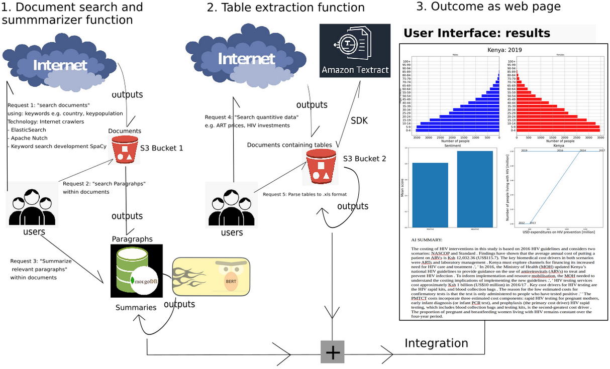
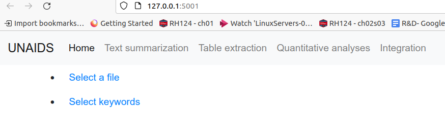

# Summary_assistant solution for UNAIDS (Continuation)

### project initiated in May 2021 by Eliecer Diaz and katariina Mahkonen  👋

## I. Overview

The Joint United Nations Programme on Aids or UNAIDS has the mission to collect HIV  data annually from the 193 UN member states; using 40 key indicators, UNAIDS creates annual report on progress towards the fight against HIV. Currently, the data collection and summarization gets published in the annual Global AIDS Report. To write this Global Aids Report, UNAIDS experts have to extract documents, scan, read a vast amount of documents, in addition, they have to be able to contrast document information for validation.

It would be more logical and efficient that an AI agent scan documents, and extract relevant paragraphs and then synthesize information.

#### the solution



Diagram of the solution. Illustration of the AI summarizer assistant solution. For simplicity, the diagram is divided into three sections: 1. Document search (manually) and AI summarizer functions (using BERT NLP model), 2. Table extraction function pipeline, and 3. the outputs from the solutions.

The requirements to run this demo are tisted in the file: requirements.txt
These requierments can be installed with the following command from the terminal:

```python
pip install -r requirements.txt
```


## II.  Operation

After clonning the repository using your terminal run the main file:

```python
python main.py
```
This command will execute the USER INTERFACE with 3 functionalities developed:



This UI contains four tabs, each one of them represents a functionality:
 
- `Text summarization` for uploading files of interest and find specific content.
- `Table extraction` for parsing pdf tables into excel or csv files. It used AWS textract service.
- `Quantitative analyses` It shows a graphical representation in the relationship between countries investments and number of people living with HIV.
- `Integration` All the results and functions from other functions are put together in
this tab. Population pyramids, investments and people living with HIV and summaries are presented in an interactive dashboard.


## 1. The text summarization

The text summarization function was built inside the UI using one of the Bert language models for text summa-
rization, and sentiment analyses: [Disitilbert](https://huggingface.co/distilbert-base-uncased-finetuned-sst-2-english) (Huggingface)

## 2. Table extraction

In ordert to have access to this [AWS textract](https://docs.aws.amazon.com/textract/latest/dg/what-is.html) service you need the following:

- Set up an account in AWS
- Set Up the AWS CLI and AWS SDKs


## 3. Quantitative analyses

Simple charts where created using UNAIDS GAM as data sources:

    - Country Expenditures GAM. 2021 https://hivfinancial.unaids.org/hivfinancialdashboards.html Accessed 11 September 2021
    - Epidemiology and treatment GAM. 2021. https://aidsinfo.unaids.org
    - Department of Economic and Social Affairs United Nations. 2020.  https://population.un.org/wpp/Download/Standard/CSV/ Accessed 11 September 2021

 
## 4. Integration

This is simple an interactive dashboard where is possible to see together charts for investments and the number of people living with HIV, population pyramids from a selected year and country. Additionally, sentiment analyses and summaries are showed from the documnent uploaded.

### Author

Eliecer Diaz, eliecerecology@gmail.com

### License

GPL (>= 2)

